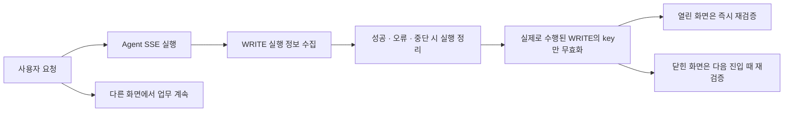
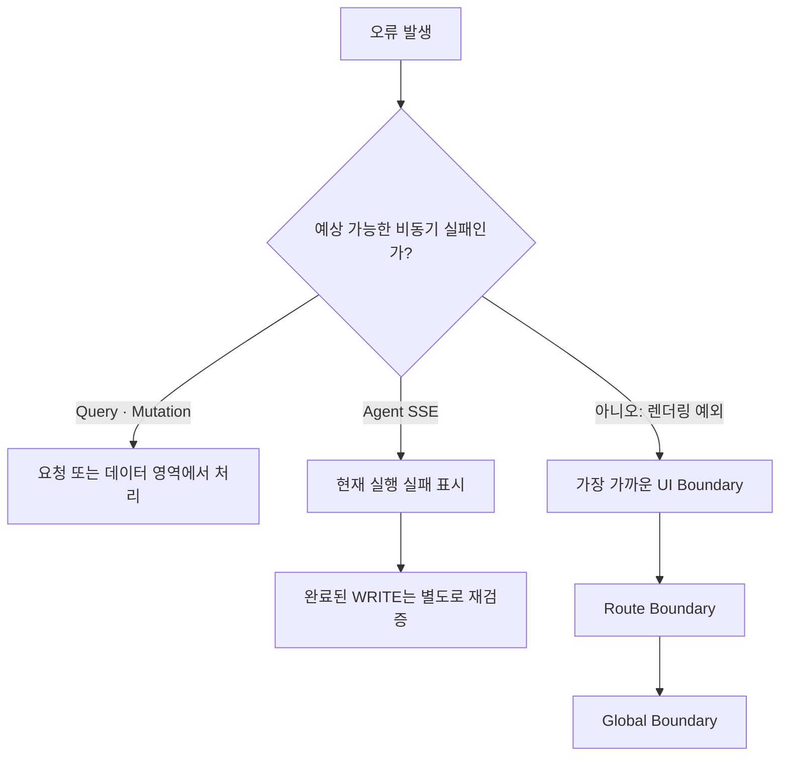
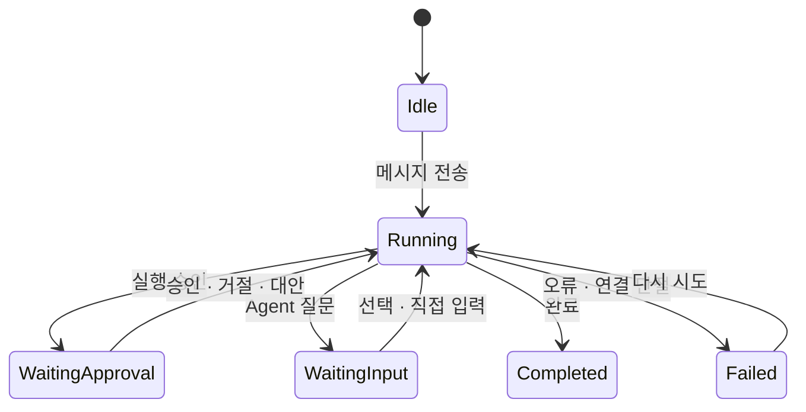

# Pretty Works 프론트엔드 아키텍처 소개

## 출발점: 두 개의 시간이 동시에 흐르는 화면

Pretty Works에서 Agent는 단순히 답변을 보여주는 채팅 UI가 아니다. 사용자 대신 할 일·회의록·일정·지출 같은 업무 데이터를 조회하고 변경하는 **두 번째 업무 주체**다.

사용자는 Agent에게 요청한 뒤 프로젝트·할 일·캘린더로 이동해 자신의 업무를 계속한다. 그동안 Agent도 같은 서버 데이터를 대상으로 독립적으로 작업하고, SSE를 통해 진행 상황과 완료 결과를 전달한다. 한 화면 안에 **사용자의 시간과 Agent의 시간이 동시에 흐르는 구조**다.

따라서 프론트엔드의 핵심 과제는 기능을 많이 제공하는 것이 아니라 다음 흐름을 끊기지 않게 연결하는 것이었다.

> **사용자와 Agent가 같은 업무 데이터를 서로 다른 시간에 다루더라도, 두 흐름이 만나는 순간 화면·오류·상태를 정확히 동기화한다.**

이를 위해 캐싱, 에러 바운더리, 상태관리를 각각 하나의 명확한 전략으로 정의했다.

| 영역 | 채택한 전략 | 해결하려는 문제 |
|---|---|---|
| 캐싱 + SSE | **Targeted Invalidation + Background Revalidation** | Agent와 사용자가 바꾼 서버 데이터를 필요한 화면에만 반영 |
| 에러 바운더리 | **Layered Fault Containment + Graceful Degradation** | 한 지점의 실패가 전체 업무 중단으로 번지는 것을 방지 |
| 상태관리 | **Single Source of Truth by State Ownership + Explicit State Machine** | 화면 이동과 비동기 Agent 실행 사이에서 상태의 주인을 명확히 유지 |

---

# PAGE 1. 캐싱 + SSE

## Targeted Invalidation + Background Revalidation

> **선택적 캐시 무효화 + 백그라운드 재검증**

### 왜 이 전략인가

일반적인 업무 화면에서는 프론트엔드가 mutation을 직접 보내므로 무엇이 바뀌었는지 즉시 안다. 반면 Agent의 쓰기는 사용자가 다른 페이지를 보는 동안 서버에서 실행된다. 프론트엔드는 **Agent가 언제, 어떤 도메인을 변경했는지 별도의 실행 이벤트를 통해 알게 된다.**

모든 업무 데이터를 계속 폴링하면 요청 비용이 커지고, 캐시 시간만 믿으면 Agent가 방금 처리한 결과가 늦게 나타난다. 그래서 Query Cache를 사용자와 Agent가 함께 바라보는 **공통 읽기 모델**로 두고, 어느 쪽에서든 변경 사건이 발생하면 관련 데이터만 stale로 만드는 방식을 선택했다.

TanStack Query가 설명하는 targeted invalidation은 query를 stale로 표시하고, 현재 화면에서 사용 중이면 백그라운드 재조회한다. 이 동작을 사용자 mutation뿐 아니라 Agent SSE 이벤트까지 확장한 것이 현재 구조다.

근거: [TanStack Query — Query Invalidation](https://tanstack.com/query/latest/docs/framework/react/guides/query-invalidation), [TanStack Query — Important Defaults](https://tanstack.com/query/latest/docs/framework/react/guides/important-defaults)

### 우리 코드에 적용한 방식

| 원칙 | 프로젝트 적용 | 연결되는 화면 |
|---|---|---|
| 조회 결과는 query key 단위로 재사용 | 일반 데이터는 짧게, 프로필·프로젝트 정보처럼 안정적인 데이터는 길게 fresh 상태 유지 | 홈, 프로젝트, 캘린더, 알림 |
| 비용이 큰 Agent 보조 조회는 별도 TTL 적용 | 화면별 추천 문구는 프론트와 서버의 5분 캐시를 맞추고, 보이는 첫 화면에서만 요청 | Agent 패널을 다시 열거나 화면을 오갈 때 불필요한 LLM 실행 방지 |
| 변경이 확인된 데이터만 무효화 | 등록·수정·삭제 mutation 성공 후 관련 목록·상세·집계 key만 stale 처리 | 할 일 등록 후 홈과 프로젝트 개요, 지출 등록 후 정산과 예산 |
| Agent 변경도 같은 규칙으로 처리 | SSE 승인 이벤트에서 실제 실행된 WRITE 도구를 기록하고 실행 종료 시 해당 도메인 key 무효화 | Agent가 만든 할 일·회의록·일정이 각 업무 화면에 반영 |
| 현재 보지 않는 화면은 나중에 갱신 | 활성 query는 즉시 재조회하고 비활성 query는 다음 진입 시 재조회 | Agent 실행 중 다른 페이지를 보고 있어도 불필요한 전체 재조회 방지 |
| 세션이 바뀌면 캐시 경계를 끊음 | 로그아웃·세션 만료 시 Query 캐시, 채팅 상태, 진행 중 스트림 정리 | 다음 로그인 사용자에게 이전 데이터가 남지 않음 |

### Agent와 업무 화면을 연결하는 SSE

SSE는 별도의 캐시 저장소가 아니라 **Agent 내부 실행을 프론트엔드가 이해할 수 있는 사건으로 바꾸는 통로**다. `step`은 진행 상태를, 승인·질문은 사용자 개입 시점을, WRITE 도구 정보는 캐시 갱신 범위를, `done`과 `error`는 한 실행의 정리 시점을 알려 준다.

사용자의 직접 수정은 mutation 성공 시점에 캐시를 무효화한다. Agent의 간접 수정은 SSE에서 실제로 실행된 WRITE 도구를 모았다가 실행이 끝날 때 무효화한다. 이때 종료는 성공만 뜻하지 않는다. 오류나 사용자 중단 전에도 일부 도구가 이미 실행됐을 수 있으므로, 그 경우에도 지금까지의 쓰기를 업무 화면에 반영한다.

근거: [WHATWG HTML Standard — Server-sent events](https://html.spec.whatwg.org/dev/server-sent-events.html)

### 이 전략이 만든 결과

Agent의 주 대화와 실행 결과 자체를 재사용하지는 않는다. 대신 대화 history와 업무 조회 결과를 재사용하고, Agent가 실제로 데이터를 변경했을 때만 화면을 다시 읽는다. 다만 첫 화면의 추천 문구는 만들 때마다 LLM이 실행되는 보조 기능이므로, 화면을 key로 프론트와 서버가 같은 5분 동안 재사용한다. **업무 결과는 변경 사건으로 동기화하고, 반복 가능한 Agent 보조 결과는 비용 기준으로 캐시하는 구조**다.

그 결과 **Agent 실행 비용과 일반 API 조회 비용을 구분하면서, 사용자 업무 화면의 정합성을 사건 단위로 맞추는 구조**가 만들어졌다.

---

# PAGE 2. 에러 바운더리

## Layered Fault Containment + Graceful Degradation

> **계층형 오류 격리 + 가능한 기능 유지**

### 왜 이 전략인가

Pretty Works의 오류는 프론트 렌더링, 일반 API, 인증, Agent 서버, SSE 연결 등 서로 다른 위치에서 발생한다. 특히 Agent 요청에는 **실행 자체의 실패**, **SSE 연결 실패**, **Agent 응답을 화면에 그리는 실패**가 함께 존재한다. 이 오류를 모두 하나로 취급하면 원인을 구분하기 어렵고, Agent 패널 하나의 문제 때문에 작성 중인 업무 화면까지 잃게 된다.

그래서 **실패를 복구 가능한 가장 작은 범위에 가두고, 나머지 기능은 계속 사용할 수 있게 하는 계층형 오류 격리 전략**을 선택했다.

React는 Error Boundary를 오류가 난 UI 대신 fallback을 보여주는 경계로 설명하며, 모든 컴포넌트를 감싸기보다 의미 있는 복구 단위를 기준으로 경계를 정하도록 안내한다. Next.js도 예상 가능한 요청 실패와 처리되지 않은 렌더링 예외를 구분하고, route 계층별 error boundary를 제공한다.

근거: [React — Catching rendering errors with an Error Boundary](https://react.dev/reference/react/Component#catching-rendering-errors-with-an-error-boundary), [Next.js — Error Handling](https://nextjs.org/docs/app/getting-started/error-handling)

### 우리 코드에 적용한 방식

| 복구 단위 | 오류 처리 | 적용된 사용자 흐름 |
|---|---|---|
| 요청 | mutation 실패를 토스트·폼 인라인 문구로 표시 | 입력값과 현재 화면을 유지한 채 다시 요청 가능 |
| 데이터 영역 | 최초 Query 실패를 해당 카드·목록의 상태 UI로 표시 | 홈의 프로젝트가 실패해도 내 할 일과 Agent 요청은 유지 |
| 백그라운드 재검증 | 기존 데이터는 유지하고 최신화 실패만 토스트로 알림 | 사용자가 보던 화면을 잃지 않음 |
| Agent 부가 기능 | 추천 생성 실패는 조용히 접고 재시도·토스트를 생략 | 추천이 없어도 대화와 업무 실행은 그대로 사용 |
| Agent 실행 | SSE 오류를 채팅 안의 실행 오류로 표시 | 기존 대화와 업무 화면을 유지한 채 같은 요청 재시도 |
| 공통 UI | GNB와 AgentView를 각각 React ErrorBoundary로 격리 | 상단바가 깨져도 본문과 Agent, Agent가 깨져도 본문 유지 |
| 페이지·앱 | 프로젝트 탭 → 일반 route → global error 순으로 확대 | 가까운 경계에서 복구할 수 없을 때만 더 큰 fallback 사용 |
| 세션 | 토큰 재발급까지 실패하면 사용자 데이터와 스트림 정리 | 오래된 화면을 남기지 않고 로그인 흐름으로 전환 |

Agent 실행 실패와 데이터 정합성도 분리한다. 실행이 마지막 답변까지 도달하지 못했더라도 그 전에 승인된 WRITE 도구가 이미 서버 데이터를 바꿨을 수 있다. 따라서 채팅에는 현재 실행의 실패를 표시하면서, 이미 수행된 쓰기에 대해서는 캐시 무효화를 진행한다. **“답변 실패”가 “아무 일도 일어나지 않음”을 의미하지 않는 Agent의 특성**을 오류 처리에 반영한 것이다.

### 이 전략이 만든 결과

이 프로젝트에서 에러 바운더리는 단순한 500 페이지가 아니다. **오류가 사용자 업무에 미치는 범위를 결정하는 기준**이다.

요청 실패는 요청 자리에서, Agent 실행 실패는 채팅에서, Agent 패널 렌더링 실패는 패널 경계에서, 나머지 페이지 예외는 route 경계에서 처리한다. 덕분에 실패 지점이 UI의 복구 범위와 연결되고, Agent 문제로 사용자의 현재 업무까지 중단되지 않는다.

---

# PAGE 3. 상태관리

## Single Source of Truth by State Ownership + Explicit State Machine

> **상태 소유권 기반 단일 원천 + 명시적 상태 전이**

### 왜 이 전략인가

Agent는 메시지를 보낸 컴포넌트의 생명주기보다 오래 실행된다. 사용자가 페이지를 이동하거나 패널을 접어도 실행은 계속되고, 홈·GNB·Agent 패널은 서로 다른 위치에서 같은 실행을 바라본다. 동시에 Agent는 사용자가 현재 보고 있는 경로와 작성 중인 폼을 이해하고, 필요하면 다른 화면의 폼을 채우는 후속 행동도 전달한다. 따라서 상태관리의 핵심 질문을 “전역 store를 사용할 것인가?”가 아니라 **“서버의 Agent 실행, 화면의 Agent 표현, Agent와 업무 화면 사이의 문맥을 누가 소유하는가?”**로 정했다.

React의 Single Source of Truth는 모든 상태를 한곳에 모으라는 뜻이 아니라, 각 상태마다 명확한 소유자를 정하라는 원칙이다. TanStack Query 역시 서버 상태와 클라이언트 상태의 책임이 다르며 두 도구를 함께 사용할 수 있다고 설명한다.

근거: [React — A single source of truth for each state](https://react.dev/learn/sharing-state-between-components#a-single-source-of-truth-for-each-state), [TanStack Query — Server state and client state](https://tanstack.com/query/latest/docs/framework/react/guides/does-this-replace-client-state)

### 우리 코드에 적용한 방식

| Agent와의 관계 | 상태의 원본과 관리 수단 | 프로젝트 적용 |
|---|---|---|
| 서버가 기억해야 하는 사실 | TanStack Query가 서버 상태를 조회 | 대화 history, pending interaction, 업무 데이터, 서버의 active run 상태 |
| 지금 화면이 표현해야 하는 실행 | Zustand가 클라이언트 실행 상태를 소유 | 현재 대화, `running`, step, 승인·질문 카드, unread, 후속 화면 제안 |
| Agent와 업무 화면이 주고받는 문맥 | 전용 Screen Context Store가 짧게 중계 | 요청 시점의 경로·폼 스냅샷 전달, 목적지 화면의 일회성 폼 채우기 |
| 현재 컴포넌트에서만 필요한 조작 | `useState`, `useReducer` | 대화 메뉴·삭제 모달·입력값처럼 화면과 함께 사라져도 되는 상태 |
| 연결을 제어하지만 화면에 그리지 않는 값 | ref와 모듈 상태 | SSE AbortController, 마지막 전송, 실행된 WRITE 도구 목록 |

이 구조에서 서버의 대화와 업무 데이터는 Query가 원본으로 유지하고, Chat Store는 그 서버 실행을 현재 UI가 사용할 수 있는 형태로 투영한다. 따라서 `useChatStore`는 단순한 메시지 배열이 아니라 홈의 Agent 요청 카드, GNB의 unread 표시, Agent 패널, SSE callback이 하나의 실행을 공유하기 위한 **Agent 도메인의 클라이언트 상태 머신**이다.

Screen Context Store는 또 다른 역할을 맡는다. 업무 화면이 입력값을 계속 전역 상태로 복제하는 대신, 메시지를 보내는 순간에만 현재 경로와 폼의 스냅샷을 Agent에 전달한다. 반대로 Agent의 폼 채우기 요청은 목적지 화면이 준비될 때까지만 보관하고 한 번 적용한 뒤 제거한다. 즉, 전역 store를 영구 저장소가 아니라 **서로 다른 UI 트리와 생명주기를 연결하는 짧은 통로**로 사용한다.

### 페이지를 연결하는 대표 흐름

| 사건 | 상태의 소유자 | 연결되는 화면 |
|---|---|---|
| Agent 실행 중 다른 페이지로 이동 | root AgentLayout과 Chat Store가 실행 상태 유지 | Agent 패널 → 프로젝트·캘린더에서도 SSE 계속 수신 |
| 접어 둔 Agent의 답변 완료 | Chat Store가 패널 가시성을 보고 unread를 켬 | Agent 패널 → GNB 새 답장 표시 |
| 홈에서 승인·질문 응답 | Chat Store가 대상 대화와 응답 요청을 Agent 패널로 전달 | 홈 확인 요청 → 올바른 대화 선택 → SSE 재개 |
| 현재 화면을 바탕으로 요청하거나 폼 채우기 | Screen Context Store가 화면 문맥과 일회성 채우기 요청을 중계 | 작성 중인 업무 화면 → Agent 판단 → 목적지 폼 반영 |
| 과거 대화 또는 진행 중 대화 선택 | Query history로 store를 복원하고 active run이면 재연결 | 대화 목록 → Agent 패널의 메시지·승인·진행 상태 복구 |
| 로그아웃·계정 전환 | Session 흐름이 Query·Chat·SSE를 함께 정리 | 이전 사용자의 실행이 다음 화면에 이어지는 것을 차단 |

### 이 전략이 만든 결과

서버 데이터를 Zustand에 모두 복제하지 않고 Query가 장기적인 사실을 관리한다. Chat Store는 SSE로 계속 바뀌는 현재 실행의 UI 표현을 맡고, 스트림이 끊기거나 새로고침되면 서버 history와 active run으로 다시 복원된다. 화면 문맥은 Screen Context Store를 잠깐 통과할 뿐 새로운 원본이 되지 않는다.

그 결과 **Agent 실행은 서버가 원본이고 Chat Store는 화면을 위한 실시간 투영이라는 경계**가 생겼다. 전역 store를 사용하는 이유도 “편해서”가 아니라, 여러 페이지와 비동기 SSE callback이 하나의 실행을 함께 표현해야 하기 때문이다.

---

# 결론

Agent가 추가되면서 프론트엔드에는 세 가지 새로운 질문이 생겼다. Agent가 남긴 결과를 언제 화면에 반영할지, Agent의 실패를 어디까지 전파할지, 페이지보다 오래 실행되는 Agent 상태를 어디에 둘지다. 세 전략은 각각 이 질문에 답한다.

| 전략 | Pretty Works에서의 의미 |
|---|---|
| Targeted Invalidation + Background Revalidation | Agent가 실제로 남긴 WRITE 결과만 관련 업무 화면에 동기화 |
| Layered Fault Containment + Graceful Degradation | Agent 실행·연결·렌더링 실패를 분리하고 사용자 업무는 유지 |
| Single Source of Truth + Explicit State Machine | 서버의 Agent 실행을 여러 페이지가 공유하는 UI 상태로 일관되게 투영 |

> **Agent가 뒤에서 실행되는 동안에도 사용자는 멈추지 않고, 실행 결과가 도착하면 필요한 데이터·오류·상태만 제자리에서 갱신된다.**
