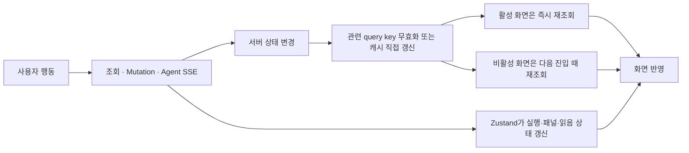
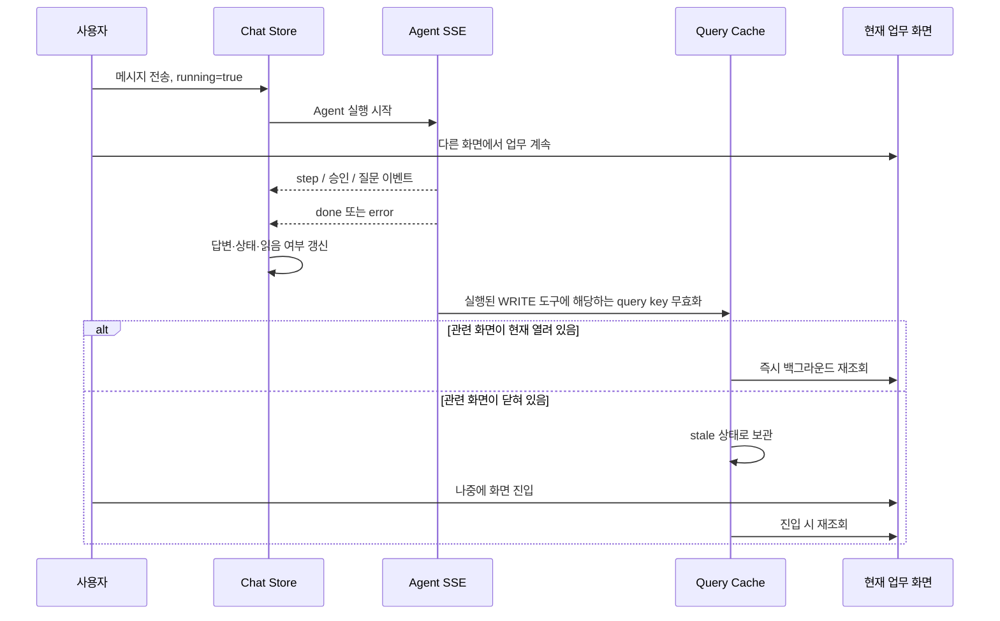
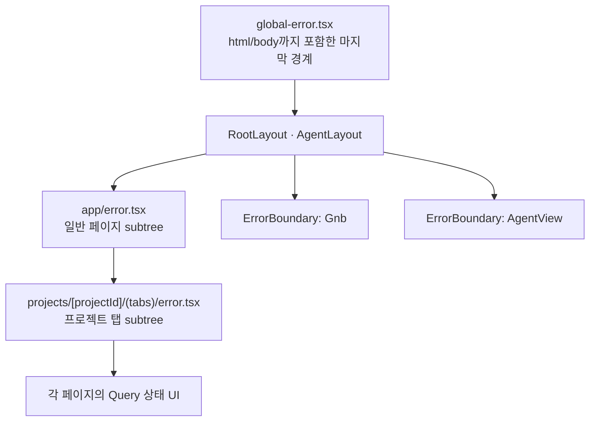
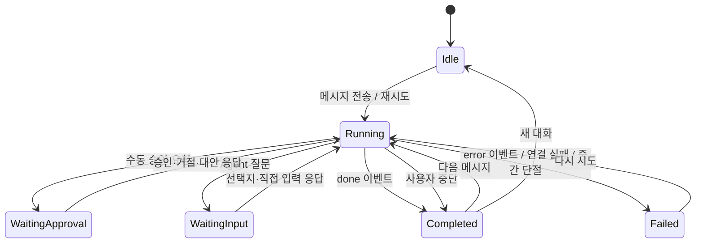
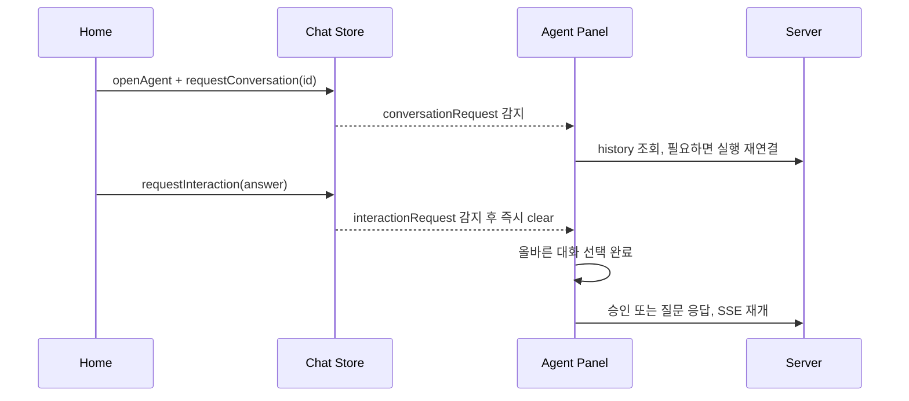

# Pretty Works 프론트엔드 아키텍처 정리

## 캐싱 · 에러 바운더리 · 상태관리 전략

> 이 문서는 현재 프론트엔드 코드가 실제로 동작하는 방식을 설명한다.  
> 개선안이나 수정 제안은 다루지 않고, 발표에서 설계 의도와 사용자 흐름을 설명할 수 있도록 현재 구현을 세 가지 관점으로 정리한다.

---

## 1. 전체 구조를 한 문장으로 설명하면

Pretty Works 프론트엔드는 **서버에서 다시 얻을 수 있는 데이터는 TanStack Query**, **여러 화면과 비동기 콜백이 함께 알아야 하는 UI 흐름은 Zustand**, **한 컴포넌트 안에서만 쓰는 값은 지역 상태**로 나눈다.

오류도 같은 기준을 따른다. 모든 오류를 전체 에러 페이지로 보내는 대신, 사용자가 계속 이용할 수 있는 범위만큼 화면을 남겨 두고 **복구할 수 있는 가장 작은 위치에서 오류를 보여준다.**

| 관점 | 현재 구현의 중심 원칙 | 대표 수단 |
|---|---|---|
| 캐싱 | 서버 응답을 재사용하되, 쓰기가 발생한 도메인만 낡은 데이터로 표시한다 | TanStack Query의 `staleTime`, query key, `invalidateQueries`, `setQueryData` |
| 에러 | 오류가 난 범위만 격리하고, 사용자가 취할 수 있는 행동과 가까운 곳에 표시한다 | Next.js `error.tsx`, React `ErrorBoundary`, `StateView`, 토스트, Agent 실행 오류 UI |
| 상태관리 | 상태의 소유 범위를 기준으로 서버 상태·전역 UI 상태·지역 상태를 분리한다 | TanStack Query, Zustand, `useState`/`useReducer`, ref 및 모듈 상태 |

---

# 2. 캐싱 전략

## 2.1 현재 캐싱은 네 층으로 구분된다

| 층 | 저장 대상 | 수명 | 현재 역할 |
|---|---|---|---|
| TanStack Query 메모리 캐시 | 프로젝트, 할 일, 일정, 알림, 사용자, Agent 대화 조회 결과 | 현재 문서의 `QueryClient`가 살아 있는 동안 | 같은 query key의 서버 응답 재사용, 백그라운드 재조회, 무효화 |
| Zustand 메모리 상태 | Agent의 현재 메시지·실행·승인·질문·읽음 상태, 토스트, 이탈 방지 | 새로고침 전까지 | 서버 응답 캐시라기보다 현재 사용자 흐름을 이어 주는 실행 상태 |
| Zustand `persist` | access token, Agent 패널 접힘 여부, 마지막 프로젝트 | `localStorage`에 남아 브라우저 재진입 후에도 유지 | 세션 복원과 UI 사용성 유지 |
| HTTP 캐시 | API 응답의 브라우저/중간 캐시 | 서버 응답 헤더에 따라 결정 | 프론트 코드에는 `Cache-Control`, ETag, Service Worker 등의 명시적 정책이 없다 |

따라서 발표에서 말하는 이 프로젝트의 주 캐싱 전략은 **HTTP 캐시가 아니라 TanStack Query 기반의 애플리케이션 캐시**다.

또한 Agent와 관련해서는 두 종류를 구분해야 한다.

- 사용자가 같은 문장을 보냈을 때 **Agent의 생성 결과 자체를 재사용하는 캐시**는 현재 없다. 메시지 전송은 매번 새로운 mutation과 SSE 실행이다.
- 대신 **대화 목록, 지난 메시지, 확인 대기 요청, Agent가 변경한 업무 데이터**를 캐시한다. 이미 끝난 대화를 다시 보기 위해 Agent를 다시 실행하지 않고, 필요한 서버 조회도 줄인다.

즉, 현재의 Agent 캐싱은 “같은 답을 다시 생성하지 않게 하는 프롬프트 캐시”라기보다 **Agent 실행 주변의 읽기 모델을 재사용하고, 쓰기 결과만 정확히 동기화하는 전략**이다.

## 2.2 전역 Query 기본 정책

`src/app/providers.tsx`에서 하나의 `QueryClient`를 만들고 앱 전체가 공유한다.

| 항목 | 현재 값 | 의미 |
|---|---:|---|
| 기본 `staleTime` | 30초 | 조회 후 30초 동안은 fresh 상태로 보고 같은 화면을 오가거나 포커스가 돌아와도 바로 재요청하지 않는다 |
| Query 재시도 | 4xx는 재시도하지 않음, 그 외 오류는 한 번 재시도 | 잘못된 요청·권한 오류처럼 반복해도 같은 결과인 실패는 다시 보내지 않는다 |
| 창 포커스/네트워크 재연결 | TanStack Query 기본 동작 사용 | stale 상태인 활성 쿼리는 창으로 돌아오거나 네트워크가 복구될 때 다시 조회한다 |
| 비활성 캐시 정리 | 별도 설정이 없어 클라이언트 기본 5분 | 화면에서 아무도 구독하지 않는 캐시는 5분 뒤 메모리에서 정리된다. 알림 목록만 `gcTime: 0`으로 즉시 정리한다 |
| Query 백그라운드 재조회 실패 | 기존 데이터가 있으면 danger 토스트 | 이미 보던 화면은 유지하고, 최신 정보만 가져오지 못했다는 사실을 알린다 |
| Mutation 실패 | 전역 danger 토스트 | 등록·수정·삭제 요청 실패의 공통 피드백을 제공한다 |
| 새로고침 후 캐시 복원 | 없음 | Query 캐시는 브라우저 새로고침 시 비워지고 필요한 화면에서 다시 구성된다 |

여기서 `staleTime`은 “30초 뒤 데이터를 삭제한다”는 뜻이 아니다. **30초 동안 재검증 없이 믿을 수 있다는 뜻**이며, 캐시 보관 수명과는 별개다.

## 2.3 조회 데이터별 캐시 정책

| 데이터 | 대표 query key | 캐시/조회 정책 | 다시 조회되는 주요 시점 |
|---|---|---|---|
| 내 프로필 | `['user', 'me']` | `staleTime: Infinity`, 로그인 토큰이 있을 때만 조회 | 로그인 후 홈·상단 UI가 마운트될 때 최초 1회, 세션 종료 후에는 전체 캐시 제거 |
| 사용자 검색 | `['user', 'search', keyword]` | 250ms 디바운스, 1분 fresh, 이전 결과 유지 | 검색 가능한 글자가 바뀌고 디바운스가 끝났을 때, 같은 검색어가 1분 이상 지난 뒤 다시 사용될 때 |
| 프로젝트 목록 | `['project', 'list', params]` | 검색어·상태·페이지 조합별 캐시 | 필터/검색/페이지 변경, 프로젝트 생성·수정·상태 변경 후 무효화 |
| 프로젝트 상세·참여자·요약 | `['project', 'detail', id]`, `['project', 'members', id]`, `['project', 'summary', id]` | 자주 바뀌지 않는 데이터는 5분 fresh | 해당 프로젝트 변경 mutation 또는 Agent 쓰기 후 무효화 |
| 게시글·회의록·지출 목록 | 프로젝트 id와 검색/페이지 조건을 query key에 포함 | 조건 변경 중에도 `keepPreviousData`로 기존 표 유지 | 조건 변경, 각 도메인의 등록·수정·삭제 성공 후 |
| 내 할 일·프로젝트 주간 할 일 | `['task', 'list']`, `['project', 'tasks', projectId, weekOffset]` | 홈과 프로젝트 화면이 각각 필요한 형태로 캐시 | 할 일 등록·수정·삭제, 상태 토글, Agent의 task 쓰기 후 |
| 캘린더 사람·연차 | `['calendar', 'people', myId]`, `['calendar', 'leaveBalance']` | 5분 fresh | 휴가 등록·수정·취소 시 연차 무효화, 사용자/프로젝트 정보는 다음 stale 재조회 시점 |
| 일정 | `['calendar', 'schedules', params]` | 보이는 날짜 범위와 사용자 목록별 캐시, 달 이동 중 이전 데이터 유지 | 달/조회 대상 변경, 일정·휴가 저장/삭제 후 |
| 알림 빨간 점 | `['notifications', 'unseen']` | 로그인 중 30초 폴링, 백그라운드 탭에서는 폴링 중지 | 30초 간격, 창 복귀, 알림 드롭다운을 열어 seen 처리할 때 캐시 직접 갱신 |
| 알림 목록 | `['notifications', 'list']` | 드롭다운이 열릴 때만 마운트, `gcTime: 0` | 드롭다운을 열 때마다 새로 조회, 닫으면 목록 캐시 제거 |
| Agent 대화 목록 | `['agent', 'conversations', size]` | 커서 기반 무한 조회, 기본 30초 fresh | Agent 실행 시작/종료, 승인·질문 응답, 읽음, 삭제, 자동 승인 변경 후 |
| Agent 지난 메시지 | `['agent', 'conversations', conversationId, 'messages']` | 대화 선택 시 `fetchQuery`, 30초 fresh | 처음 대화를 열 때, 같은 대화를 30초가 지난 뒤 다시 열 때, 삭제 시 캐시 제거 |
| Agent 확인 대기 요청 | `['agent', 'pending-interactions']` | `staleTime: 0`, 30초 폴링, 백그라운드 폴링 중지 | 폴링, 창 복귀, 승인/질문 발생·응답·중단·삭제 시 |

## 2.4 “언제 재요청하는가”를 사용자 행동 기준으로 보면

`invalidateQueries`는 관련 캐시를 즉시 삭제하는 동작과 다르다. 해당 데이터를 **stale 상태로 표시**하고, 현재 화면에서 사용 중인 활성 쿼리는 바로 다시 요청한다. 다른 화면의 비활성 쿼리는 다음에 그 화면을 열 때 다시 요청한다.

| 사용자 행동 | 즉시 일어나는 일 | 다시 조회하거나 갱신하는 데이터 |
|---|---|---|
| 로그인 성공 | access token 저장 후 홈으로 이동 | 홈에서 마운트되는 프로필, 프로젝트, 할 일, Agent 대기 요청, 알림 상태 등을 최초 조회 |
| 로그아웃 | 성공/실패와 관계없이 세션 정리 후 로그인 화면 이동 | Query 캐시 전체 제거, Agent 스트림 중단, 채팅 상태·마지막 프로젝트 제거 |
| access token 만료 | 한 번만 토큰 재발급 후 원래 요청 재시도 | 재발급도 실패하면 로그아웃과 같은 세션 정리 수행 |
| 프로젝트 생성 | 서버 성공 확인 | 프로젝트 목록 무효화 |
| 프로젝트 수정 | 서버 성공 확인 | 프로젝트 상세, 마일스톤, 프로젝트 목록 무효화 |
| 프로젝트 상태 변경 | 서버 성공 확인 | 프로젝트 상세와 프로젝트 목록 무효화 |
| 할 일 생성·수정·삭제 | 서버 성공 확인 | 홈의 내 할 일과 프로젝트 주간 할 일 무효화 |
| 할 일 완료 토글 | 서버 성공 확인 | 호출한 화면이 넘긴 query key를 무효화 |
| 마일스톤 완료 토글 | 성공 또는 실패로 요청 종료 | 마일스톤 캐시를 서버 상태로 다시 맞춤 |
| 일정·휴가 저장 | 서버 성공 확인 | 일정 전체, 휴가라면 연차 현황도 무효화 |
| 일정·휴가 삭제 | 화면에서 먼저 제거하는 낙관적 갱신 | 실패하면 스냅샷 복원, 요청 종료 후 일정 및 필요한 연차 캐시 재조회 |
| 게시글 등록·수정·삭제 | 성공 확인 | 게시글 목록과 프로젝트 AI 요약 무효화, 수정은 상세 캐시를 응답으로 즉시 교체 |
| 회의록 등록·수정·삭제 | 성공 확인 | 회의록 목록과 프로젝트 AI 요약 무효화, 수정은 상세 캐시를 응답으로 즉시 교체 |
| 지출 등록·수정·삭제 | 성공 확인 | 지출 목록, 예산 집계, 프로젝트 AI 요약 무효화 |
| AI 요약 새로고침 버튼 | 새 요약 응답 수신 | 별도 재조회 없이 요약 캐시를 응답값으로 직접 교체 |
| 알림 드롭다운 열기 | seen mutation 실행 | 빨간 점 캐시를 즉시 `false`로 변경; 목록은 열리면서 조회 |
| 알림 항목 클릭 | 해당 항목 read mutation 실행 후 이동 | 쌓인 페이지 전체를 다시 받지 않고 그 항목의 `read` 값만 직접 변경 |
| Agent 대화 선택 | 기존 스트림 분리, 읽음 처리, history 조회 | 30초 이내 history는 캐시 재사용; 읽음 성공 후 대화 목록 무효화 |
| Agent 대화 삭제 | 성공 후 Zustand 목록에서도 제거 | 해당 history 캐시 제거, 대화 목록과 확인 대기 요청 무효화 |

## 2.5 Agent가 뒤에서 실행될 때의 캐시 흐름

Agent 패널을 접는 것은 컴포넌트를 없애는 동작이 아니라 레이아웃을 접는 동작이다. `AgentView`와 스트림 연결은 root layout 아래에 계속 살아 있으므로, 사용자가 다른 화면을 보고 있어도 실행 이벤트를 받을 수 있다.

Agent 실행에서 중요한 것은 **실제로 실행된 WRITE 도구를 모았다가 실행이 끝나는 경계에서 관련 데이터만 무효화한다는 점**이다.

- 자동 승인된 WRITE 도구는 승인 이벤트를 받는 즉시 실행 목록에 기록한다.
- 수동 승인은 사용자가 실제로 승인했을 때만 실행 목록으로 옮긴다.
- `done`뿐 아니라 오류, 중단, 대화 전환으로 스트림을 끊을 때도 이미 반영된 쓰기를 기준으로 무효화한다.
- 읽기 도구나 거절된 쓰기는 업무 화면을 바꾸지 않았으므로 무효화 대상이 아니다.
- 한 실행에서 여러 도구가 같은 query key를 바꿔도 중복을 제거해 한 번만 무효화한다.

### Agent WRITE 도구와 무효화 대상

| Agent 도구 | 낡아지는 화면 데이터 |
|---|---|
| `meeting.create` | 회의록 목록, 프로젝트 AI 요약 |
| `task.create`, `task.toggleStatus` | 홈 내 할 일, 프로젝트 주간 할 일 |
| `milestone.toggleStatus` | 프로젝트 마일스톤 |
| `expense.create` | 지출 목록, 예산 집계, 프로젝트 AI 요약 |
| `schedule.create`, `schedule.update` | 캘린더 일정 |
| `leave.create`, `leave.update` | 캘린더 일정, 연차 현황 |
| `replan.apply` | 할 일, 마일스톤, 프로젝트 상세, 프로젝트 목록 |
| `replan.save`, `gmail.send` | 현재 프론트 화면에 반영되는 데이터가 없어 무효화하지 않음 |
| 표에 없는 새 도구 | 프로젝트·할 일·캘린더·알림 도메인을 넓게 무효화 |
| 도구 이름을 알 수 없는 승인 | 위와 같이 도메인을 넓게 무효화 |

프로젝트 AI 요약에는 두 단계의 부하 제어가 있다. 프론트는 5분 동안 요약을 fresh로 재사용하고 관련 쓰기가 발생하면 캐시를 무효화한다. 코드 주석에 명시된 서버 정책상, 서버도 마지막 생성 후 최소 간격 동안은 LLM을 다시 호출하지 않고 저장된 요약을 반환한다. 즉, 프론트 무효화는 클라이언트의 추가 지연을 없애지만 서버의 생성 간격 정책까지 우회하지 않는다.

---

# 3. 에러 바운더리 전략

## 3.1 핵심 기준: 오류의 종류와 복구 범위를 분리한다

이 프로젝트에서 “에러 바운더리”는 React의 `ErrorBoundary`만을 뜻하지 않는다. 사용자 관점에서는 아래의 모든 오류 표시 계층이 하나의 에러 전략을 이룬다.

| 오류 종류 | 오류가 뜻하는 것 | 현재 표시 위치 | 화면 유지 범위 |
|---|---|---|---|
| 최초 Query 실패 | 화면에 필요한 서버 데이터를 처음부터 얻지 못함 | 해당 카드·목록·상세의 `StateView` 또는 `Result` | 다른 카드와 레이아웃은 유지 |
| 기존 데이터가 있는 재조회 실패 | 이미 볼 데이터는 있지만 최신화에 실패함 | 기존 데이터 유지 + 전역 danger 토스트 | 현재 작업을 그대로 계속할 수 있음 |
| Mutation 실패 | 사용자가 요청한 등록·수정·삭제가 완료되지 않음 | 전역 토스트와 호출 화면의 인라인/모달/토스트 처리 | 입력 화면과 기존 데이터 유지 |
| Agent 실행 실패 | Agent 이벤트 또는 SSE 요청이 정상 완료되지 않음 | 채팅 답변 자리의 `RunErrorNotice` | 앱과 기존 채팅은 유지, 같은 요청 재시도 가능 |
| Agent 대화 조회 실패 | 목록 또는 선택한 history를 가져오지 못함 | 대화 메뉴/채팅 내부 상태 문구 | 업무 화면과 Agent 패널의 나머지 기능 유지 |
| 렌더링 예외 | 컴포넌트가 예상하지 못한 값을 그리다 예외 발생 | 가장 가까운 React/Next 오류 경계 | 경계 밖 UI는 계속 사용 가능 |
| 인증 만료 | 현재 사용자의 서버 세션을 더 이상 사용할 수 없음 | 로컬 세션 정리 후 로그인 화면, 필요한 경우 토스트 | 이전 사용자의 데이터는 남기지 않음 |
| 404 | 주소가 없거나 삭제된 화면 | 공통 `ErrorPage` | 홈으로 이동 가능 |

## 3.2 렌더링 오류 경계의 계층

| 경계 | 잡는 상황 | 대체 UI | 사용자가 할 수 있는 일 |
|---|---|---|---|
| `ErrorBoundary(name="Gnb")` | 상단 메뉴 렌더링 중 예상 밖의 예외 | “상단 메뉴를 표시하지 못했어요” | 상단 메뉴만 다시 렌더링 시도, 페이지와 Agent는 유지 |
| `ErrorBoundary(name="AgentView")` | 서버가 보낸 말풍선·선택지 등 Agent 패널 렌더링 예외 | “AI 패널을 표시하지 못했어요” | Agent 패널만 다시 렌더링 시도, 본문과 GNB는 유지 |
| 프로젝트 탭 `error.tsx` | 프로젝트 탭 콘텐츠 subtree의 렌더링 예외 | 프로젝트 화면용 500 결과 | 해당 탭을 다시 시도하거나 LNB를 이용해 이동 |
| 루트 `app/error.tsx` | root layout 아래 일반 페이지 subtree의 처리되지 않은 예외 | 공통 500 `ErrorPage` | 홈으로 이동하거나 해당 segment 재시도 |
| `global-error.tsx` | root layout 자체를 포함해 위 경계로 격리되지 못한 예외 | 독립적인 최소 HTML 오류 화면 | 전체 루트 다시 시도 |

React 오류 경계는 **렌더링 중 예외를 격리하는 장치**다. Query와 mutation의 비동기 실패는 여기로 던지지 않으며, `isError`, mutation callback, Agent 스트림 callback에서 별도로 처리한다.

## 3.3 Query 오류가 화면에 표시되는 논리

Query 전역 오류 처리에는 `query.state.data !== undefined` 조건이 있다.

| Query 상태 | 판단 | 사용자에게 보이는 결과 |
|---|---|---|
| 데이터가 없고 최초 요청 중 | 아직 그릴 서버 데이터가 없음 | 해당 위치의 로딩 UI |
| 데이터가 없고 최초 요청 실패 | 해당 영역을 정상적으로 구성할 수 없음 | `StateView`, `Result`, 팝오버 인라인 오류 등 해당 위치의 실패 UI |
| 기존 데이터가 있고 재조회 중 | 과거 데이터로 화면을 계속 사용할 수 있음 | 기존 화면을 유지하며 백그라운드에서 조회 |
| 기존 데이터가 있고 재조회 실패 | 화면은 유지할 수 있지만 최신 정보가 아님 | 기존 화면 유지 + “최신 정보를 불러오지 못했어요” 계열 토스트 |

이 구조 덕분에 프로젝트 화면 안의 카드 하나가 실패했다고 전체 프로젝트가 에러 페이지가 되지 않는다. 예를 들어 프로젝트 개요에서는 프로젝트 상세, 마일스톤, 주간 할 일이 각각 로딩·오류 상태를 가진다.

## 3.4 Mutation 오류가 화면에 표시되는 논리

모든 mutation 실패는 `MutationCache.onError`를 통해 기본 danger 토스트를 발생시킨다. 동시에 각 호출부는 사용자 행동의 문맥을 알고 있으므로 더 구체적인 상태를 함께 표현한다.

| 문맥 | 지역 처리 예시 |
|---|---|
| 로그인 입력/자격 오류 | 사번·비밀번호 필드에 인라인 오류와 에러 테두리 표시 |
| 로그인 서버/네트워크 오류 | 로그인 실패 모달 표시 |
| 폼 저장 오류 | 폼 내부 오류 문구를 유지하고 작성값을 보존 |
| 삭제·중단 등 단발 행동 | 성공/실패 결과를 토스트로 표시 |
| 낙관적으로 제거한 일정 삭제 실패 | Query 캐시 스냅샷을 복원한 뒤 서버 상태를 다시 조회 |
| Agent 자동 승인 설정 실패 | 이전 토글 값으로 복원하거나 다음 대화 전환 시 서버값으로 동기화 |

서버의 `message`나 `errorCode`를 그대로 사용자에게 노출하지 않는다. `errorCode`는 `errorMessage.ts`의 사용자 문장으로 변환하고, 표에 없는 코드·네트워크 실패·5xx는 호출 위치가 정한 fallback 문구로 바꾼다.

## 3.5 Agent 오류는 채팅 문맥 안에서 분리한다

Agent 오류는 일반 REST 오류와 달리 요청 하나가 긴 스트림으로 이어지고, 중간에 승인이나 질문으로 여러 구간으로 나뉜다. 따라서 오류도 “Agent 패널 전체 실패”와 “현재 실행 실패”를 구분한다.

| 발생 지점 | 처리 | 표시 |
|---|---|---|
| HTTP/SSE 연결 실패 | `AgentStreamError`의 error code를 안전한 문장으로 변환 | 현재 답변 자리의 `RunErrorNotice` |
| SSE `error` 이벤트 | 이벤트의 code만 사용자 문장으로 변환하고 서버 원문 message는 노출하지 않음 | `RunErrorNotice`와 다시 시도 버튼 |
| `done`/`error` 없이 스트림 종료 | 실행이 여전히 `running`이면 중간 단절로 판단 | “답변이 도중에 끊겼어요” |
| 사용자가 중지해 발생한 abort | 의도한 중단이므로 실행 오류로 표시하지 않음 | 취소된 Agent 말풍선 |
| 모르는 SSE 이벤트 | 앞으로 서버 이벤트가 늘어나도 화면이 깨지지 않도록 무시 | 개발 환경 Agent 로그만 남김 |
| SSE payload JSON 파싱 실패 | 해당 이벤트만 버림 | 개발 환경에 event 이름과 payload 로그 |
| 과거 대화에 저장된 실패 message | 예외명·스택·경로·코드 토큰을 제거하고 안전한 문장만 사용 | 실패 스타일의 과거 말풍선 |
| AgentView 렌더링 자체 실패 | 현재 실행 오류가 아니라 패널 렌더링 사고로 판단 | Agent 전용 React ErrorBoundary fallback |

현재 실행 실패는 `runError`에 저장되며 다음 요청을 시작할 때 지워진다. 마지막 전송 내용과 첨부 파일은 ref에 보관되어, 다시 시도 버튼은 실패 말풍선을 하나 더 쌓지 않고 같은 요청을 다시 연다.

## 3.6 로딩 전략과 Suspense 사용 여부

현재 코드에는 `Suspense`, `useSuspenseQuery`, route `loading.tsx`가 없다. 로딩은 각 요청 상태를 화면 문맥에 맞게 명시적으로 렌더링한다.

| 로딩 종류 | 기준 상태 | UI |
|---|---|---|
| 인증 store hydration | 토큰 persist 복원이 끝나지 않음 | 로고와 전체 화면 로딩 UI |
| Query 최초 조회 | `isLoading` 또는 `isPending` | `StateView`, `Result`, 테이블 스켈레톤, 팝오버 상태 문구 |
| 페이지/검색 조건 변경 | `keepPreviousData`가 적용된 Query | 이전 목록을 유지하고 새 조건을 백그라운드 조회 |
| Query 백그라운드 재조회 | `isFetching` | 기존 데이터 유지; 필요한 위치만 재시도 버튼 로딩 등으로 표현 |
| Mutation 진행 | `isPending` | 저장/삭제/로그인 버튼 loading 또는 입력 차단 |
| Agent 실행 | Chat Store의 `running` | 마지막 step을 보여 주는 `AgentRunIndicator`, composer는 중지 버튼 제공 |
| Agent 과거 대화 조회 | `historyLoading` | 채팅 내부 “대화를 불러오는 중...” 문구, composer 차단 |
| 무한 목록 다음 페이지 | `isFetchingNextPage` | 기존 목록 아래에 추가 로딩 문구 |

## 3.7 오류 위치를 찾는 데 사용되는 정보

| 오류 경로 | 현재 남는 위치 정보 |
|---|---|
| GNB/Agent 렌더링 오류 | `[Gnb] 렌더 실패`, `[AgentView] 렌더 실패` 이름과 React component stack |
| Next route 오류 | `error` 객체와, 서버 렌더 오류인 경우 대조 가능한 `digest` |
| Agent 요청/이벤트 오류 | 개발 환경에서 요청 경로, HTTP status, run id, event type, sequence, 대화 id가 포함된 문맥 로그 |
| API 사용자 오류 | 백엔드 error code와 화면용 문장 매핑 |
| 세션 만료 | 세션 종료 code를 로그인 화면까지 전달해 종료 이유 표시 |

Agent 전용 디버그 로그는 production에서는 비활성화된다. React/Next 경계의 외부 오류 수집 서비스는 현재 연결되어 있지 않고, 코드에는 연동 지점이 TODO로 표시되어 있다. 따라서 현재 구현에서 개발자가 보는 주 관측 채널은 경계 이름과 문맥을 포함한 브라우저 콘솔이다.

---

# 4. 상태관리 전략

## 4.1 상태를 저장 위치별로 나눈 기준

| 상태 종류 | 저장 위치 | 판단 기준 | 예시 |
|---|---|---|---|
| 서버 상태 | TanStack Query | 서버가 원본이며 query key로 다시 얻을 수 있음 | 프로젝트, 할 일, 일정, 알림, Agent 대화 history |
| 전역 UI/흐름 상태 | Zustand | 서로 먼 컴포넌트, layout, 비동기 callback이 함께 읽고 씀 | Agent 패널, 현재 실행, 읽음, 토스트, 이탈 방지 |
| 지역 UI 상태 | `useState`, `useReducer` | 현재 화면이나 컴포넌트가 사라지면 함께 사라져도 됨 | 모달 열림, 폼 입력, 메뉴 열림, 캘린더 필터 |
| 렌더와 무관한 실행 메모리 | `useRef`, 모듈 변수 | 화면을 다시 그릴 필요 없이 비동기 실행 사이에서만 이어야 함 | 현재 AbortController, 실행된 WRITE 도구 집합, 마지막 전송 파일 |

이 기준에서 Zustand의 “전역”은 단순히 많은 곳에서 쓴다는 의미만이 아니다. **컴포넌트 트리 밖의 API interceptor/SSE callback에서도 접근해야 하거나, 서로 다른 화면이 하나의 사용자 흐름을 이어 받아야 하는 상태**도 포함한다.

## 4.2 Zustand store별 책임

| Store | 핵심 상태 | 전역이어야 하는 현재 이유 | 영속화/정리 |
|---|---|---|---|
| `useAuthStore` | `accessToken` | AuthGuard, Axios interceptor, Agent fetch, 로그인 화면, 인증이 필요한 Query가 함께 사용 | 전체 store를 `localStorage`에 persist; 로그아웃/세션 만료 시 clear |
| `useToastStore` | 현재 토스트 한 개 | 화면뿐 아니라 QueryCache·MutationCache처럼 React hook 밖에서도 알림을 띄워야 함 | 메모리만 사용; 새 토스트가 이전 토스트를 대체하고 타이머로 종료 |
| `useLeaveGuardStore` | 저장하지 않은 변경 여부, 이동하려던 URL | 폼은 본문에 있고 이동을 발생시키는 GNB·LNB·알림·헤더는 layout에 있어 서로 직접 상태를 전달하기 어려움 | 메모리만 사용; 폼 생명주기에 맞춰 설정/해제 |
| `useLastProjectStore` | 마지막으로 본 `projectId` | 프로젝트 화면과 전역 GNB의 “프로젝트” 진입점이 상태를 공유 | `projectId`만 persist; 로그아웃·계정 전환 시 clear |
| `useAgentStore` | `folded`, `expanded` | AgentLayout, GNB, 홈, AgentView, 읽음 판정이 같은 패널 가시성을 알아야 함 | `folded`만 persist; `expanded`는 새로고침 시 기본값 |
| `useChatStore` | 현재 대화, 메시지, 실행, 승인/질문, 읽음, 화면 간 요청 | Agent SSE callback, 패널, GNB unread 점, 홈의 확인 요청 카드가 하나의 실행 상태를 공유 | persist하지 않음; 로그아웃 시 대화 목록까지 reset |

### 토스트가 store인 이유

토스트 렌더러인 `ToastViewport`는 root layout에 한 번만 존재한다. 각 기능은 `showToast()`만 호출하며, Query/Mutation 전역 오류 callback은 `useToastStore.getState()`를 통해 React 컴포넌트 밖에서도 토스트를 띄운다.

토스트는 배열이 아니라 한 개만 보관한다. 빠르게 여러 결과가 생기면 마지막 토스트가 이전 것을 대체한다. 각 토스트에는 고유 id가 있어 이전 타이머가 늦게 끝나도 새 토스트를 지우지 않는다.

## 4.3 `useChatStore`가 담당하는 상태 묶음

`useChatStore`는 값이 많지만 모두 “현재 Agent 대화를 끊김 없이 이어 가기 위한 상태”라는 하나의 목적 아래 묶여 있다.

| 상태 묶음 | 필드 | 역할 |
|---|---|---|
| 대화 식별 | `conversations`, `activeId`, `conversationId` | 목록에서 선택한 대화와 서버 대화 id 연결 |
| 실행 식별 | `runId` | SSE 재연결과 실행 취소 |
| 화면 메시지 | `messages` | 사용자 메시지를 즉시 추가하고 SSE 최종 답변을 이어 붙임 |
| 실행 상태 | `running`, `runSteps`, `runError` | spinner, 입력 차단, 현재 step, 재시도 UI 결정 |
| 사용자 확인 대기 | `pendingChoice`, `pendingApproval`, `pendingInteractionId` | Agent 질문·도구 승인을 한 장의 선택 UI로 표현하고 응답 API와 연결 |
| 실행 후 행동 | `pendingAction` | 작업 완료 뒤 관련 화면 이동 또는 외부 URL 열기 제안 |
| 화면 간 전달 | `interactionRequest`, `conversationRequest` | 홈의 확인 요청 카드가 Agent 패널에 “이 대화를 열고 응답하라”고 전달 |
| history 상태 | `historyLoading`, `historyLoadError` | 과거 대화 선택 시 로딩·실패·composer 차단 |
| 대화별 표현 | `autoApprove`, conversation의 `status`·`unread` | 자동 승인 토글, 실행/대기 점, 새 답장 점 |

서버가 영구 보관하는 대화 목록과 메시지는 API에서 다시 얻을 수 있지만, 스트림으로 메시지가 한 줄씩 들어오고 승인·질문·읽음이 서로 연쇄되므로 현재 화면의 실행 형태로 Zustand에 동기화한다.

## 4.4 Agent 실행 상태 전이

| 사건 | Chat Store 변화 | 대화 목록 표시 |
|---|---|---|
| 메시지 전송 | 사용자 말풍선 추가, `running=true`, 이전 오류/후속 행동 제거 | 현재 대화 `RUNNING` |
| step 수신 | `runSteps`에 추가 | 마지막 step을 실행 indicator에 표시 |
| 수동 승인 요청 | `running=false`, 승인 카드와 interaction id 저장 | `WAITING_APPROVAL` |
| 자동 승인 요청 | 승인 카드는 만들지 않고 WRITE 도구만 기록 | 실행 상태 유지 |
| 질문 수신 | `running=false`, 질문/선택지와 interaction id 저장 | `WAITING_INPUT` |
| 승인·질문 응답 | 대기 카드를 비우고 `running=true` | 다시 `RUNNING` |
| 완료 | Agent 답변 추가, step 제거, 후속 action 저장 | `COMPLETED`, 패널 가시성에 따라 unread 결정 |
| 실패 | `runError` 저장, 대기 카드와 step 제거 | `FAILED` |
| 중단 | 실행을 즉시 끝내고 취소 말풍선 추가 | `COMPLETED` |

## 4.5 패널 열림/닫힘과 읽음 상태의 연쇄

읽음은 “서버에서 답이 왔는가”만으로 정하지 않고 **답이 왔을 때 사용자가 실제로 패널을 볼 수 있었는가**까지 함께 본다.

| 상황 | 로컬 unread | 서버 read mutation | 결과 |
|---|---:|---:|---|
| Agent 패널을 펼쳐 둔 상태에서 답변 완료 | `false` | 현재 대화를 읽음 처리 | GNB와 대화 목록에 새 답장 점이 생기지 않음 |
| Agent 패널을 접어 둔 사이 답변 완료 | `true` | 보내지 않음 | GNB Agent 아이콘과 대화 목록에 새 답장 점 표시 |
| 사용자가 해당 대화를 선택 | 즉시 `false` | 읽음 처리 요청 | 서버 응답을 기다리지 않고 점이 먼저 꺼짐 |
| 읽음 처리보다 대화 목록 재조회가 먼저 도착 | 펼쳐 보고 있는 대화는 sync 과정에서 다시 `false`로 보정 | 요청 완료 뒤 목록 재조회 | 방금 끈 점이 잠깐 되살아나는 현상 방지 |
| 다른 대화에 unread가 있음 | 그대로 유지 | 해당 대화를 열 때만 읽음 처리 | 현재 대화를 보고 있어도 다른 대화의 새 답장은 보존 |

`useHasUnreadConversations`는 대화 중 하나라도 `unread`이면 `true`를 반환한다. 이 파생 상태를 GNB와 Agent header가 함께 사용하므로, 어느 화면을 보고 있든 새 답장 표시가 같다.

## 4.6 다른 화면에서 Agent 흐름을 이어 가는 방식

홈에는 “확인이 필요한 요청” 카드가 있고 실제 SSE 재개 로직은 Agent 패널에 있다. 두 화면 사이를 직접 props로 연결할 수 없으므로 Chat Store가 일회성 요청을 전달한다.

일회성 요청을 store에서 읽은 즉시 비우는 이유는 같은 응답이 effect 재실행으로 두 번 전송되어 409가 발생하는 것을 막기 위해서다. 또한 먼저 올바른 대화를 선택하고 history를 복원한 뒤 실행을 이어, 새 답변이 다른 대화에 쌓이지 않게 한다.

## 4.7 대화 전환과 복원 흐름

| 순서 | 동작 | 상태관리 의미 |
|---:|---|---|
| 1 | 현재 스트림 연결을 끊고, 이미 수행한 WRITE 도구의 캐시 무효화를 flush | 이전 대화 이벤트와 데이터 변경을 정리 |
| 2 | 선택한 `activeId`/`conversationId`를 저장하고 이전 메시지·실행·오류·대기 상태 초기화 | 새 대화 화면이 이전 대화 상태를 상속하지 않음 |
| 3 | 로컬 unread를 끄고 서버 read mutation 실행 | 화면 반응과 서버 상태를 함께 맞춤 |
| 4 | query cache에서 30초 fresh history를 찾고 없거나 stale이면 서버 조회 | 짧은 재방문에는 같은 history 재사용 |
| 5 | messages, autoApprove, active run, pending approval 복원 | 서버가 가진 대화 상태를 현재 UI 상태로 변환 |
| 6 | active run이 `RUNNING`이면 같은 run id로 SSE 재연결 | 화면을 떠난 동안 진행된 실행을 이어 받음 |
| 7 | `WAITING_INPUT`이면 pending-interactions에서 질문을 찾아 복원 | 질문 카드가 사라진 채 대화가 막히는 것을 방지 |

## 4.8 자동 승인 상태의 연쇄

자동 승인은 대화별 서버 설정이지만, 현재 대화의 토글 반응은 Chat Store가 즉시 보여준다.

- 기존 대화에서 토글하면 store를 먼저 변경하고 mutation을 보낸다.
- 성공하면 서버가 돌려준 값을 다시 store에 반영한다.
- 실패하면 기존 대화에서는 이전 값으로 되돌린다.
- 아직 서버 대화 id가 없는 새 대화에서 토글하면 우선 로컬 상태만 바꾼다.
- 첫 실행의 `runId`로 새 `conversationId`를 대화 목록에서 찾은 뒤, 기본값과 다를 때 서버로 설정을 보낸다.
- 승인 카드의 “항상 허용”을 선택하면 해당 요청을 승인하면서 현재 대화의 자동 승인 토글도 즉시 켠다.

## 4.9 새로고침·로그아웃 시 상태 수명

| 상태 | 일반 화면 이동 | 브라우저 새로고침 | 로그아웃/세션 만료 |
|---|---|---|---|
| Query 캐시 | 유지 | 제거 | 명시적으로 전체 clear |
| Chat Store | root AgentLayout이 유지되는 동안 계속 실행 | 제거 후 서버 대화 목록/history로 다시 구성 | 대화 목록까지 reset |
| 진행 중 Agent 스트림 | 패널 접기·일반 페이지 이동에도 유지 | 브라우저 연결 종료 후 대화 재선택 시 active run 재연결 가능 | 명시적으로 abort |
| access token | 유지 | `localStorage`에서 복원 | clear |
| Agent `folded` | 유지 | `localStorage`에서 복원 | 사용자 UI 선호로 남음 |
| Agent `expanded` | 유지 | 기본값으로 복귀 | 별도 세션 정리 대상 아님 |
| 마지막 프로젝트 | 유지 | `localStorage`에서 복원 | 사용자별 값이므로 clear |
| 토스트 | root viewport에서 표시 | 제거 | 일반 로그아웃의 soft navigation에서는 현재 타이머 수명에 따르고, 세션 만료의 전체 이동에서는 제거된 뒤 종료 문구만 로그인 화면으로 전달 |
| 화면별 폼/모달/필터 | 해당 컴포넌트가 마운트된 동안 | 제거 | 화면 이탈과 함께 제거 |

다른 브라우저 탭에서 인증 정보가 바뀌면 `storage` 이벤트로 access token store를 다시 hydrate한다. 같은 사용자에 대한 토큰 재발급이면 화면을 유지하고, 사용자 id가 달라지면 마지막 프로젝트를 지운 뒤 홈 또는 로그인 화면을 문서 단위로 다시 연다. 이때 새 문서가 만들어지므로 이전 탭의 Query/Chat 메모리 상태도 함께 사라진다.

---

# 5. 발표용 핵심 정리

## 5.1 캐싱 전략

> “Agent 답변 자체를 캐시한 것이 아니라, 서버에서 다시 얻을 수 있는 대화와 업무 데이터를 query key 단위로 재사용했습니다. 일반 mutation과 Agent WRITE 도구가 서버 상태를 바꾸면 관련 key만 stale로 만들고, 현재 보고 있는 화면은 즉시, 닫힌 화면은 다음 진입 때 다시 조회합니다. 그래서 사용자가 다른 일을 하는 동안 Agent가 실행되어도 완료 시점에 화면 데이터가 자연스럽게 동기화됩니다.”

## 5.2 에러 바운더리 전략

> “오류를 하나의 전역 에러 화면으로 모으지 않고 복구 가능한 범위에 따라 나눴습니다. 최초 조회 실패는 해당 카드나 상세 화면에서, 백그라운드 최신화 실패와 mutation 실패는 토스트로, Agent 실행 실패는 채팅 안에서, 렌더링 예외는 GNB·Agent·프로젝트 탭·앱 전역 순서의 경계에서 처리합니다. 한 부분의 실패 때문에 사용 가능한 나머지 화면까지 잃지 않는 구조입니다.”

## 5.3 상태관리 전략

> “서버가 원본인 데이터는 TanStack Query, 여러 화면과 SSE callback이 함께 이어야 하는 사용자 흐름은 Zustand, 한 화면 안에서 끝나는 입력·모달·필터는 지역 상태로 관리했습니다. 특히 Chat Store는 메시지 배열만 저장하는 곳이 아니라 실행, 승인, 질문, 재연결, 읽음까지 하나의 상태 머신으로 연결하는 역할을 합니다.”

---

# 6. 주요 근거 코드

| 주제 | 파일 |
|---|---|
| QueryClient 기본 정책·전역 Query/Mutation 오류 | `src/app/providers.tsx` |
| 세션 종료 시 캐시·스토어 정리 | `src/lib/auth/session.ts`, `src/lib/api/queryCache.ts` |
| Agent WRITE 도구별 캐시 무효화 | `src/features/agent/utils/writeToolCache.ts` |
| Agent 실행·SSE·무효화 경계 | `src/features/agent/hooks/useAgentRun.ts` |
| Agent 대화 조회·history 캐시·재연결 | `src/features/agent/hooks/useAgentConversations.ts` |
| Agent Query/Mutation key | `src/features/agent/hooks/queries`, `src/features/agent/hooks/mutations` |
| Chat 상태 머신·읽음 판정 | `src/features/agent/stores/useChatStore.ts` |
| Agent 패널 UI 상태 | `src/features/agent/stores/useAgentStore.ts` |
| 전역 토스트 | `src/stores/useToastStore.ts`, `src/layouts/Toast/ToastViewport.tsx` |
| 렌더링 오류 격리 | `src/components/ErrorBoundary/ErrorBoundary.tsx`, `src/layouts/AgentLayout.tsx` |
| Next route/global 오류 화면 | `src/app/error.tsx`, `src/app/global-error.tsx`, `src/app/projects/[projectId]/(tabs)/error.tsx` |
| Query 로딩·오류·빈 상태 | `src/components/StateView/StateView.tsx` |
| API 오류 문장 변환 | `src/lib/api/errorCode.ts`, `src/lib/api/errorMessage.ts` |
| Agent 스트림 오류 변환 | `src/features/agent/api/agentStream.ts`, `src/features/agent/api/agentApi.ts` |
| Agent 현재 실행 오류 UI | `src/features/agent/components/RunErrorNotice/RunErrorNotice.tsx` |
| 인증·패널·이탈 방지·마지막 프로젝트 상태 | `src/stores/useAuthStore.ts`, `src/features/agent/stores/useAgentStore.ts`, `src/stores/useLeaveGuardStore.ts`, `src/features/project/stores/useLastProjectStore.ts` |
